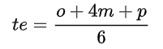

# Project_Management(PERT_CPM) 
### Theme: Use PERT to decide routes which one is critical path

### **Team Member**    

|     編輯者       |    暱稱     |Email                                                           |
| :-----------:|:-----------:   |:---------------------------------------------------------------------------------------: |
|  施智臏      | ZHI-BIN SHIH     |[shih.zhi.bin@gmail.com](shih.zhi.bin@gmail.com)     
|  Mr.Tsai    |  Louie Tsai       |[eru085730@gmail.com](eru085730@gmail.com)
### **Reference**
Author:PinoyStat  ,   Youtube: https://www.youtube.com/watch?v=UXPeO2d9nSs  
## Tutorial of the PERT_CPM
<details open="open">
  <summary><b>Table of Contents</b></summary>
  <ol>
    <li>
      <a href="#introduction">Introduction</a>
      <ul>
        <li><a href="#PERT_CPM">PERT_CPM</a></li>
    </li>
      </ul>
    <li>
      <a href="#the-model">python</a>
       <ul>
        <li><a href="#Package">Package</a></li>
        <li><a href="#Object">Define a class object </a></li>
        <li><a href="#Function">Define Function </a></li>
        <li><a href="#Determine the critical path from the result">Output result</a></li>
         
# __Introduction__
If you are faced with many tasks at work, how to decide which tasks to perform first.Searching online resources suggest PERT(__Program Evaluation and Review Technique__) to schedule tasks.The program evaluation and review technique (PERT) is a statistical tool used in project management, which was designed to analyze and represent the tasks involved in completing a given project.
## __PERT_CPM__
> __PERT__ is a method of analyzing the tasks involved in completing a given project, especially the time needed to complete each task and to identify the minimum time needed to complete the total project. It incorporates uncertainty by making it possible to schedule a project while not knowing precisely the details and durations of all the activities.On the otherhand PERT and CPM are complementary tools, because __CPM__ employs one time estimation and one cost estimation for each activity; __PERT__ may utilize three time estimates (__optimistic, expected, and pessimistic__) and no costs for each activity.
 
# __The Model__
## __Package__
```python 
#Download package
import numpy as np
import pandas as pd  
import re
import os 
```         
## __Object__         
```python      
#Define a class object named task:
class Task(object):
    def __init__(self,activity,predecessors,duration):
        self.activity = activity.upper()   
        self.predecessors = predecessors
        self.duration = duration
        self.earlyStart = 0
        self.earlyfinish = 0
        self.successors = []
        self.lastStart = 0
        self.lastfinish = 0
        self.slack = 0
        self.critical = ""
#Calculate the slack(Slack Time = LST – EST)
    def computeSlack(self):
        self.slack = self.lastfinish - self.earlyfinish
        if self.slack > 0 :
            self.critical = "NO"
        else:
            self.critical = "YES"
```
## __Function__   
```python  
         
#Get data from excel and return a pandas data frame 
def readData(excelFile):
    global mydata
    mydata = pd.read_csv(excelFile)
    return mydata
``` 
                 
`Optimistic time`: the minimum possible time required to accomplish an activity (`o`) , assuming everything proceeds better than is normally expected.
         
`Pessimistic time`: the maximum possible time required to accomplish an activity (`p`) , assuming everything goes wrong (but excluding major catastrophes).
         
`Most likely time`: the best estimate of the time required to accomplish an activity (`m`) , assuming everything proceeds as normal.
      
`Expected time`: the best estimate of the time required to accomplish an activity (`te`) . 
         
<p style="text-align:center">
  
</p>
        
```python 
#Calculate the time spent on the task
def computeDuration(mydata):
    mydata["DURATION"] = np.ceil((mydata["OPT"]+ mydata["MOST"]*4 + mydata["PESS"])/6)   
    return mydata
```

```python 
#Function to creat a task object:  
def creatTask(mydata):
    taskObject = []
    
    for i in range(len(mydata)):
        taskObject.append(Task(mydata["ACTIVITY"][i],
        mydata["PREDECESSORS"][i],mydata["DURATION"][i]))
        
    return (taskObject)        
```         
 
__Determining ES EF with Forwardpass__
         
`EF(EarlyFinish)`= `ES` + `D`(Duration)

`ES(EarlyStart)`= `Max(EF)` -> Maximum `EF` of all pre-jobs

```python         
def forwardPass(taskObject):
    for task in taskObject:
        if type(task.predecessors) is str: #type string
            #make the string uppercase
            task.predecessors = task.predecessors.upper()
            ef = [] #store the EF of all of the task's predecessors..
            #get the maximum latestfinish
            for j in task.predecessors:
                for t in taskObject:
                    if t.activity == j :
                        ef.append(t.earlyfinish)
                task.earlyStart = max(ef)
            del ef
        else:
            task.earlyStart = 0
            
        task.earlyfinish = task.earlyStart + task.duration
```   

__Determining LS LF with Forwardpass__      
         
         
```python
def backwardPass(taskObject):
    pred = []
    eF = []
    
    
    for task in taskObject:
        if type(task.predecessors) == str :
            for j in task.predecessors:
                pattern = re.compile(r'[A-Z]')
                match = pattern.finditer(j)
                for r in match:
                    pred.append(j)
                    for m in taskObject:
                        if m.activity == j:
                            m.successors.append(task.activity)
        eF.append(task.earlyfinish)
    
    for task in reversed(taskObject):
        if task.activity not in pred:
            task.lastfinish = max(eF)
        else:
            minLs = []
            for x in task.successors:
                for t in (taskObject):
                    if t.activity == x:
                        minLs.append(t.lastStart)
            task.lastfinish = min(minLs)
            del minLs
        task.lastStart = task.lastfinish - task.duration
```  
                  
__Caculate the slack( By computeSlack funtion)__
         
```python
def slack(taskObject):
    for task in taskObject:
        task.computeSlack()
``` 
         
__Update Dataframe__ 
         
```python        
def updateDataframe(df,TaskObject):
    df2 = pd.DataFrame({
        'ACTIVITY':df["ACTIVITY"],
        'PREDECESSORS': df ["PREDECESSORS"],
        'OPT':df["OPT"],
        'MOST':df["MOST"],
        'PESS':df["PESS"],
        'DURATION':df["DURATION"],
        "ES":pd.Series([task.earlyStart for task in TaskObject]),
        "EF":pd.Series([task.earlyfinish for task in TaskObject]),
        "LS":pd.Series([task.lastStart for task in TaskObject]),
        "LF":pd.Series([task.lastfinish for task in TaskObject]),
        "SLACK":pd.Series([task.slack for task in TaskObject]),
        "CRITICAL?":pd.Series([task.critical for task in TaskObject])})
    return (df2)     
```          
         
__Main code__
         
```python      
def main():
    pd.set_option('display.width',1000)
    os.system("clear")
    df = readData("network.csv")
    print("Loaded data:")
    print(df)
    
    df = computeDuration(df)
    taskObject = creatTask(df)
    
    forwardPass(taskObject)
    backwardPass(taskObject)
    slack(taskObject)
    
    finaldf =updateDataframe(df,taskObject)
    print("\nResults:")
    print(finaldf)
    
    print("\nResult saved to pertcpm.csv\n")
    finaldf.to_csv("pertcpm.csv",index = False)
#run the program:
    
main()        
```           
## __Determine the critical path from the result__ 
<table>
  <tr>
    <td>ACTIVITY</td>
    <td>PREDECESSORS</td>
    <td>OPT</td>
    <td>MOST</td>
    <td>PESS</td>
    <td>DURATION</td>
    <td>ES</td>
    <td>EF</td>
    <td>LS</td>
    <td>LF</td>  
    <td>Slack</td>
    <td>CRITICAL?</td>      
  </tr>
  <tr>
    <td>A</td>
    <td></td>
    <td>6</td>
    <td>14</td>
    <td>16</td>
    <td>13</td>
    <td>0</td>
    <td>13</td>
    <td>0</td>
    <td>13</td>
    <td>0</td>
    <td>YES</td>
  </tr>    
  <tr>
    <td>B</td>
    <td></td>
    <td>6</td>
    <td>15</td>
    <td>30</td>
    <td>16</td>
    <td>0</td>
    <td>16</td>
    <td>9</td>
    <td>25</td>
    <td>9</td>
    <td>NO</td>
  </tr>  
  <tr>
    <td>C</td>
    <td></td>
    <td>2</td>
    <td>5</td>
    <td>8</td>
    <td>5</td>
    <td>0</td>
    <td>5</td>
    <td>11</td>
    <td>16</td>
    <td>11</td>
    <td>NO</td>  
   </tr>  
   <tr>
    <td>:</td>
    <td>:</td>
    <td>:</td>
    <td>:</td>
    <td>:</td>
    <td>:</td>
    <td>:</td>
    <td>:</td>
    <td>:</td>
    <td>:</td>
    <td>:</td>
    <td>:</td>  
   </tr>  
 </table>
